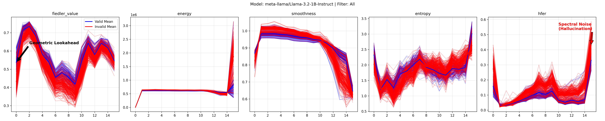

# Geometry of Reason: Spectral Signatures of Logical Validity

[](https://arxiv.org)
[](https://pypi.org/project/spectral-trust/)

This repository is the official implementation for the paper "**Geometry of Reason: Spectral Signatures of Valid Reasoning in Transformers**" (Noël, 2025).

It contains the code to reproduce the Inverse Scaling and Spectral Phase Transition results across Llama-3, Qwen-2.5, and Phi-3.5.

## Highlights


⚡️ **The Discovery: "The Shape of Truth"**
**Figure 1**: We discover that valid reasoning has a distinct geometric signature. When the model hallucinates (Red), spectral noise explodes. When it reasons correctly (Blue), energy collapses into a 'smooth' state.

## Repository Structure

- `src/geometry_of_reason/`: Core library code (Work in Progress).
- `scripts/`: Executable scripts for experiments and analysis.
    - `run_experiment.py`: Main entry point for running spectral analysis on models.
    - `run_perplexity.py`: Baseline comparison script.
    - `analysis/`: Scripts for ablations, visualizations, and statistical checks.
    - `data/`: Data generation and preparation utilities.
    - `reporting/`: Scripts to generate final paper tables.
- `data/`: Dataset and Results.
    - `results/`: JSON outputs from experiments.
    - `proofs/`: The raw MiniF2F proof dataset.
    - `reclaimed/`: **The Gold Mine**. Contains the 51 "invalid" proofs (rejected by Lean) that our spectral method identified as logically valid. Manual verification confirmed these are mathematically correct.

## Quick Start

### 1. Installation
Ensure you have the `spectral_trust` library and dependencies installed:
```bash
pip install spectral_trust
pip install -r requirements.txt
```

### 2. Running an Experiment
To analyze a model (e.g., Llama-3.1-8B) with 4-bit quantization:
```bash
python scripts/run_experiment.py --model meta-llama/Meta-Llama-3.1-8B-Instruct --load-in-4bit --stats
```

### 3. Reproducing Paper Results
To generate the full statistical report (Table 1 & 2 in the paper):
```bash
python scripts/reporting/generate_paper_report.py
```

### 4. Running Ablations
To reproduce the ablation studies (Robustness, Transfer, etc.):
```bash
python scripts/analysis/ablations.py --file data/results/experiment_results_Meta-Llama-3.1-8B-Instruct.json --list-b data/reclaimed/8B_list_b_confident_invalid.json
```

## Visualizations
Effect size plots and spectral trajectories can be generated using:
```bash
python scripts/analysis/viz_effect_size.py ...
```

## Reference
This code relies on the [`spectral-trust`](https://pypi.org/project/spectral-trust/) library for core GSP (Graph Signal Processing) operations.


## Related Spectral Works
This repository is part of a broader research agenda on **Spectral Interpretability** using graph theory to detect the "shape" of model cognition without training.

If you are interested in this method, check out our related works on RAG and Linguistics:

* **For Agentic RAG:**
    * **Paper:** *Catching Contamination Before Generation: Spectral Kill Switches for Agents* (AAAI 2026)
    * **Link:** [arXiv:2511.05804](https://arxiv.org)
    * **Finding:** We use the High-Frequency Energy Ratio (HFER) to detect inconsistent or contaminated context in RAG systems with >99% AUC.

* **For Linguistics:**
    * **Paper:** *Training-Free Spectral Fingerprints of Voice Processing* (Under Review, 2026)
    * **Link:** [arXiv:2510.19131](https://arxiv.org)
    * **Finding:** We demonstrate that attention heads in Layers 2-5 form distinct spectral fingerprints for syntactic structures (active vs. passive voice) across 20 languages.

* **For Mathematical Reasoning (This Repo):**
    * **Paper:** *Geometry of Reason: Spectral Signatures of Valid Reasoning* (2025)
    * **Link:** Soon
    * **Finding:** We identify a phase transition in attention smoothness ($d > 3.3$) that distinguishes valid logical reasoning from hallucinations.
```
